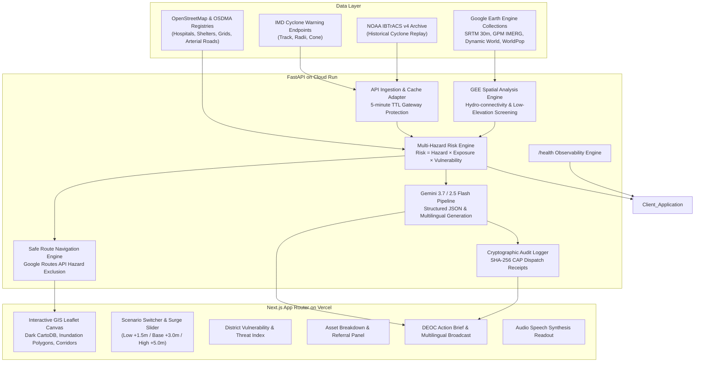

# SagarRakshak AI — System Architecture

SagarRakshak AI is built on a decoupled, cloud-scalable architecture designed to process multi-hazard geospatial satellite feeds and provide sub-second decision support for disaster management authorities in India.

---

## 1. High-Level Architecture Diagram

---

## 2. Component Specifications

### 2.1 Geospatial Engine (Google Earth Engine)
- **Elevation:** USGS SRTM 30m DEM (`USGS/SRTMGL1_003`) identifies coastal lowlands below 5.0m elevation.
- **Rainfall:** NASA GPM IMERG V07 (`NASA/GPM_L3/IMERG_V07`) computes 6h, 12h, and 24h accumulated rainfall compared against historical percentile thresholds.
- **Surface Water:** JRC Global Surface Water (`JRC/GSW1_4/GlobalSurfaceWater`) removes persistent lakes, lagoons (Chilika), and estuaries from surge screening calculations.
- **Population:** WorldPop 100m Population Density (`WorldPop/GP/100m/pop`) estimates the number of citizens residing in each intersecting risk buffer.

### 2.2 Risk & Vulnerability Formula
The engine computes composite risk using transparent, configurable weights:
$$Risk = \text{normalize}(w_H \cdot \text{Hazard} + w_E \cdot \text{Exposure} + w_V \cdot \text{Vulnerability})$$

Where:
- $\text{Hazard} = w_{hw} \cdot \text{Wind} + w_{hr} \cdot \text{Rainfall} + w_{hs} \cdot \text{Surge}$
- $\text{Exposure} = w_{ep} \cdot \text{PopScore} + w_{ea} \cdot \text{Criticality} + w_{er} \cdot \text{Capacity}$
- $\text{Vulnerability} = w_{ve} \cdot \text{ElevVuln} + w_{vf} \cdot \text{FloodHistory} + w_{vp} \cdot \text{PowerBackup} + w_{vr} \cdot \text{RouteRedundancy}$

### 2.3 Gemini Grounded Advisory Generation
- Ingests a structured Evidence Packet containing computed metrics, storm status, and threatened facilities.
- Constrained with system prompts preventing hallucinated casualties or coordinates.
- Validates output using Pydantic JSON schemas.
- Produces simultaneous broadcasts in **English, Hindi, and Odia**.
